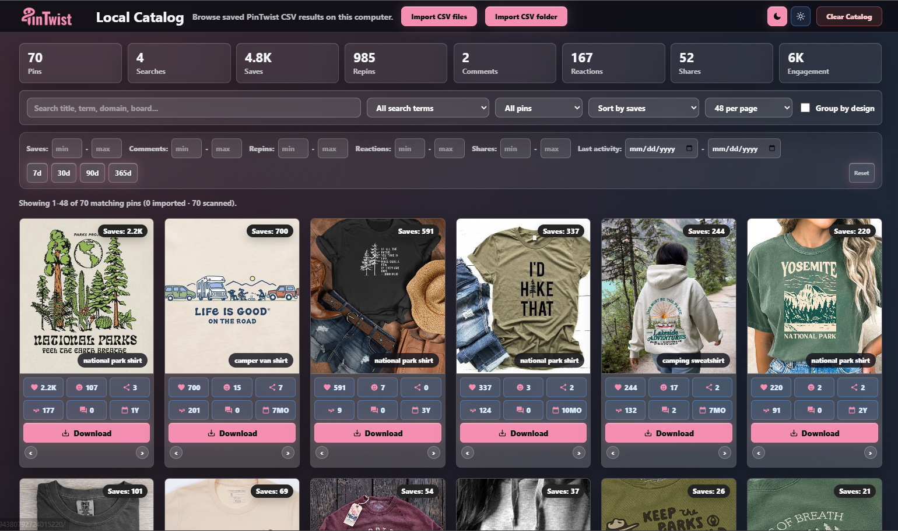

# PinTwist

Local-only Chrome extension for Pinterest research. It runs entirely on your
machine — no account, no remote server, no backend.

> PinTwist is an independent, unofficial tool. It is not affiliated with,
> endorsed by, or sponsored by Pinterest. See [`TRADEMARKS.md`](./TRADEMARKS.md).



## What It Does

- Adds the PinTwist toolbar on Pinterest pages.
- Sorts pins by saves, shares, reactions, repins, comments, or newest.
- Filters sorted results.
- Downloads images and CSV exports.
- Keeps the Local Catalog/gallery on your device — imported pins in IndexedDB (so it scales
  to large catalogs), live-scanned pins in `chrome.storage.local`.
- Uses Pinterest requests from the active Pinterest page/session.
- Optional automation queue: run a saved list of searches back-to-back, paced with
  deliberate delays (see below).

## Automation Queue (optional)

Instead of typing each search by hand, you can queue a list of terms and let PinTwist
run them one after another, sorting and collecting into your Local Catalog as it goes.
It exists to save repetitive manual clicking during research — not to hide activity or
evade anything.

To stay a considerate Pinterest client, it:

- **Paces itself.** It waits a randomized delay between searches rather than firing them
  as fast as possible, so it doesn't hammer the site.
- **Backs off, doesn't push through.** If Pinterest returns a rate limit or shows a
  security / captcha check, the queue **pauses and surfaces that to you** and waits for the
  cooldown — it does not attempt to bypass the check. You clear it in the page and resume.

It uses only your own logged-in Pinterest session, reads the same public pin metrics the
toolbar already shows, and — like the rest of PinTwist — sends nothing to any server. Use
it responsibly and within Pinterest's terms.

## What It Doesn't Do

- No user login.
- No account.
- No third-party authentication.
- No cookies permission.
- No remote backend.
- No telemetry, ingest, or backend data collection.

## Local Data

Captured rows accumulate in the current Chrome profile: live-scanned pins in
`chrome.storage.local["pintwist_catalog_rows"]`, and CSV-imported pins in a local
IndexedDB database (`pintwist_catalog`) so the catalog can scale to large research
corpora. They stay local unless the user exports CSV files or modifies the extension.

See [`PRIVACY.md`](./PRIVACY.md).

## Load In Chrome

1. Build from the project root:

```bash
corepack pnpm install
corepack pnpm run build
```

2. Open `chrome://extensions`.
3. Enable Developer mode.
4. Click `Load unpacked`.
5. Select `dist`.

## Verify

From the project root:

```bash
corepack pnpm run typecheck
corepack pnpm test
node --check js/content.js
node --check js/background.js
node --check popup.js
corepack pnpm run build
node --check dist/js/content.js
node --check dist/js/background.js
node --check dist/popup.js
```

## Contributing

PinTwist is maintainer-led and welcomes contributions that fit its direction and
its local-only, no-backend constraint. Please read
[`CONTRIBUTING.md`](./CONTRIBUTING.md) (it uses DCO sign-off — `git commit -s`)
and [`GOVERNANCE.md`](./GOVERNANCE.md).

## License

PinTwist is licensed under the Apache License, Version 2.0 — see
[`LICENSE`](./LICENSE) and [`NOTICE.md`](./NOTICE.md).

## Project Documents

- [`LICENSE`](./LICENSE) — Apache-2.0
- [`NOTICE.md`](./NOTICE.md) — attribution and copyright
- [`TRADEMARKS.md`](./TRADEMARKS.md) — brand use + Pinterest non-affiliation
- [`CONTRIBUTING.md`](./CONTRIBUTING.md) — how to contribute (DCO sign-off)
- [`GOVERNANCE.md`](./GOVERNANCE.md) — maintainer-led governance
- [`SECURITY.md`](./SECURITY.md) — report a vulnerability
- [`SUPPORT.md`](./SUPPORT.md) — getting help
- [`CODE_OF_CONDUCT.md`](./CODE_OF_CONDUCT.md)
- [`PRIVACY.md`](./PRIVACY.md)
